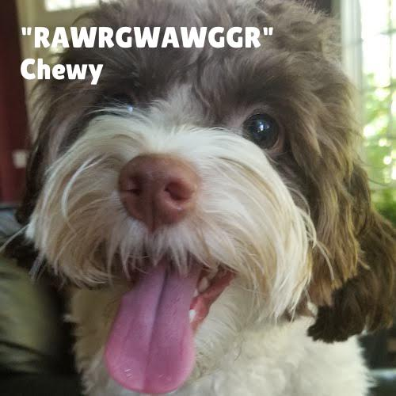
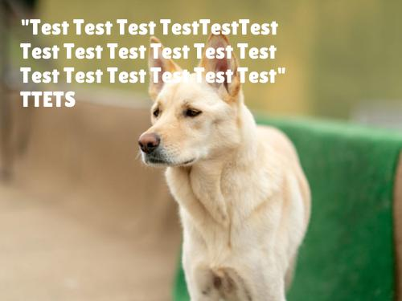

#Meme generator

A meme generator to create dog memes for the Udacity Intermediate Python nanodegree.

##Set up and start

* `pip install -r requirements.txt` 
* `brew install pdftotext`
* check `python3 -m unittest`

If tests are OK, you can start the meme generator in two ways:
1. As a CLI tool, saving the meme to a specified path. Run `python3 meme.py -h` for more instructions
2. As a web service offering a REST api, using flask. Start by executing `python3 app.py`

##Project Description
The application consists of two modules, one to load quotes from persistence, and one to generate a meme, which are 
both plumbed and used by `meme.py` and `app.py`.

The **QuoteEngine** module offers an `Ingestor`, which can be used to load quotes from all supported file types. This is
accomplished using a strategy pattern. A certain file type (pdf, txt, csv, ...) is thus loaded by a certain strategy 
(if available), and all available strategies are encapsulated in the `Ingestor`.

The **MemeGenerator** module solves the task of writing a quote to an image file, using pillow. From a high level, this is 
done in the following steps:

1. Determine the initial text size from the image (A character should have one fiveteenth of the image height)
2. Write the quote to image in a dry-run and measure the size of the resulting `textbbox`.
3. If the `textbbox` fits into the image, write the text to the image at a random location and return the image.
4. If the `textbbox` is too wide, use `textwrap` to wrap the text, and measure again.
5. If the wrapped text fits in the available height, write the text to the image at a random location and return the
   image.
6. If the `textbbox` is too high, decrease the font size and go to step 2.

##Samples

A simple sample of a meme:

An example of a wrapped meme: 

